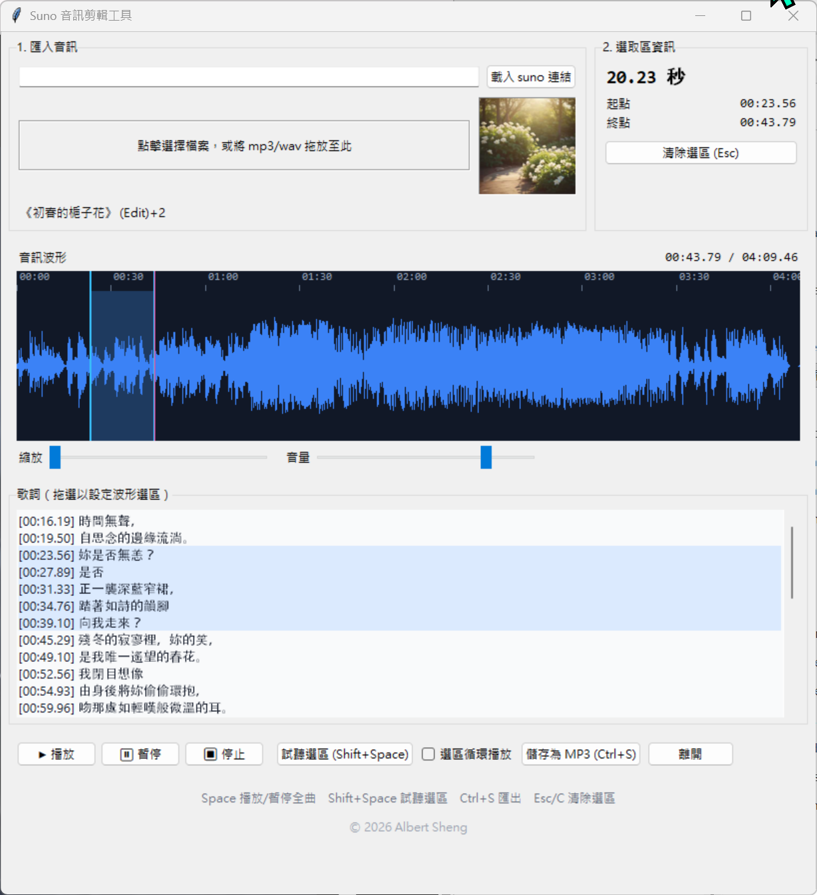

# Suno Audio Editor

**Version 2.0** · Python 3.13 · Tkinter · Windows

A desktop app for trimming Suno-generated songs. Load a Suno share link or a local audio file, drag a region on the waveform, preview it, and export it as an MP3.



## Features

- **Import** — Suno share link, CDN URL, bare UUID, or any local `mp3 / wav / m4a / ogg / aac` file. Drop files anywhere in the window.
- **Cover art & title** — auto-fetched from embedded ID3/MP4/FLAC tags for local files, or scraped from `suno.com/song/{id}` for Suno URLs.
- **Waveform selection** — drag to create, drag edges to resize, drag interior to move. Peaks stay visible under the selection tint.
- **Playback** — three explicit buttons (▶ 播放 / ⏸ 暫停 / ⏹ 停止), region preview, region loop, volume control.
- **Zoom** — slider fits the whole song to canvas at 0%, zooms 20× at 100%. Visible time window is preserved across window resizes.
- **Export** — slice + re-encode via ffmpeg. Filename format: `{title}_from_{mm}_{ss}{cs}_to_{mm}_{ss}{cs}.mp3` (cs = centiseconds).
- **Keyboard** — Space toggles play, Shift+Space previews region, Ctrl+S saves, Esc/C clears selection.

## Install

Requires **ffmpeg on PATH** (hard dependency — used for both decoding and encoding).

```
pip install -r requirements.txt
python main.py
```

For development (adds `pytest`):

```
pip install -r requirements-dev.txt
pytest              # 84 tests
pytest -m network   # +1 opt-in network integration test
```

## Docs

- [`status.md`](status.md) — full feature list, architecture, v1 → v2 changelog, known limitations.
- [`CLAUDE.md`](CLAUDE.md) — module-by-module architecture, feature-parity contract, coding rules for this repo.

## License

© 2026 Albert Sheng.
